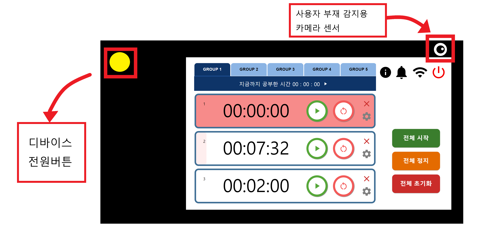
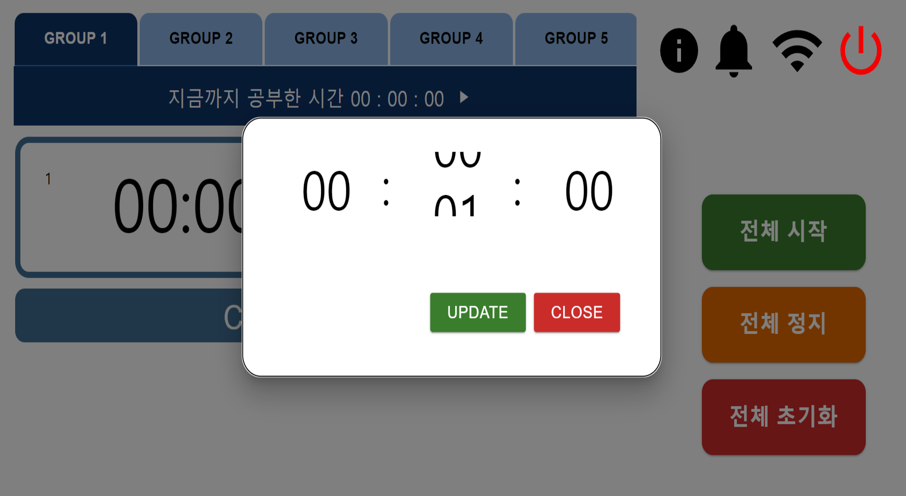
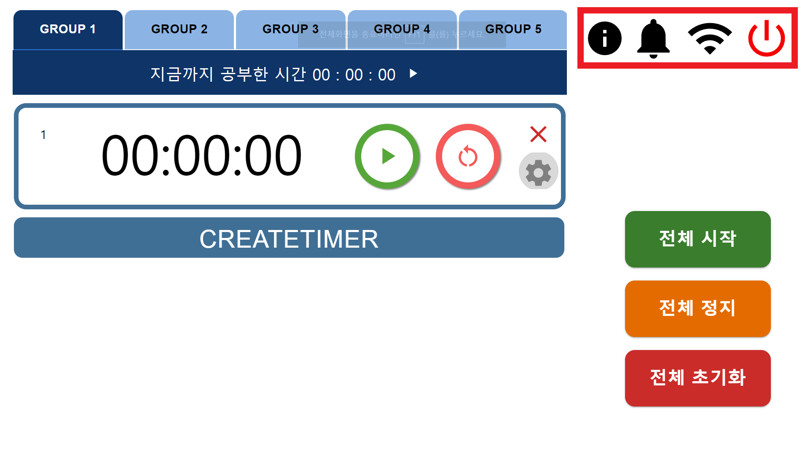
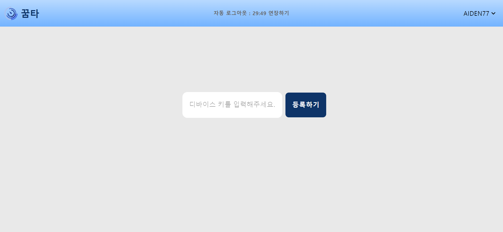
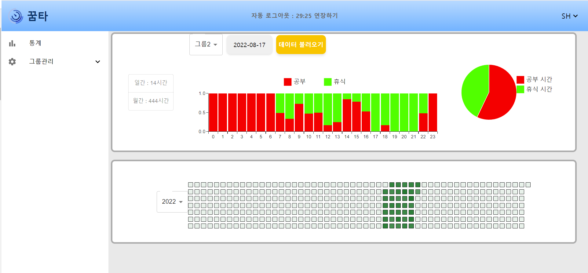
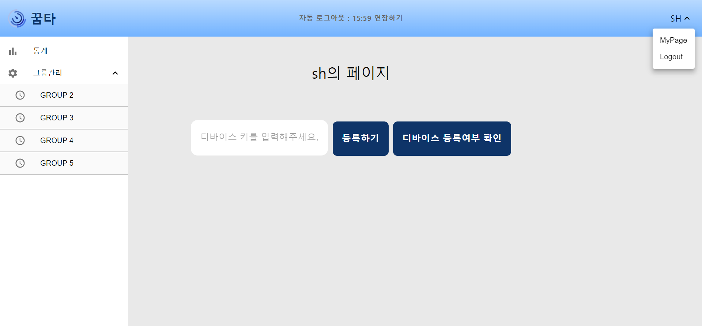
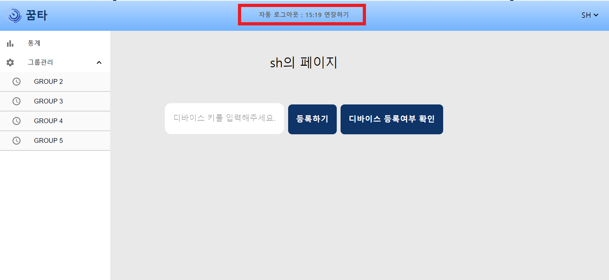

# DreamTimer

## 목차

#### ✔︎ 프로젝트 소개

#### ✔︎ 팀원 소개

#### ✔︎ 주요페이지 설명

#### ✔︎ 기술 설명

#### ✔︎ 백엔드 상세설명

#### ✔︎ 회고

## 프로젝트 소개

### 개발동기 : 2023년 기준 40만명이 넘는 수험생들에게 도움이 되는 web IOT 장비를 만들고자 함

    - 일부 수험생들이 공부시간을 측정하고자 타이머를 사용하지만 아래와 같은 단점이 있음
        - 기존 타이머들은 버튼 조작이 불편함
        - 과목별로 또는 문제단위로 여러개의 타이머를 쓰는데에 무리가 있음
        - 원하는 세팅을 저장하거나 불러 올 수 없음
        - 스마트폰의 타이머나 기존 서비스를 이용할 시 스마트폰에 의존하거나 중독 될 우려가 있음

### 기획의도 => 사용자(수험생)에게 편리함 제공

    -그룹타이머 & 멀티타이머 기능
        - 50개의 타이머를 저장&불러오기, 일괄동작 가능
        - 타이머 동작로그를 기반으로 공부시간 측정
    -자리 이탈 감지 기능
        - 카메라센서를 이용한 얼굴인식 기능으로 자리이탈 감지
        - 자리 이탈시 알람 and 타이머 중지
    -web에서 Report 확인가능
        - 타이머를 사용한것 만으로 자신의 공부시간을 수치화 & 그래프화해서 볼 수 있음
        - 잔디그래프형태를 지원

### 프로젝트 구조

    - 배포
        - Gitlab
        - Jenkins
        - Docker
    - 웹
        - React(Front), Express(Back)
    - 디바이스
        - React, Express, Mosquitto

## 팀원 소개

    -김성민 (팀장,백엔드)
        -역할 :발표 및 프로젝트 총괄 , DB설계, 인증&권한 관련 api작성 , SNS 로그인 구현 , 디바이스 wi-fi 연결
    -김상현 (백엔드,프론트엔드)
        -역할 : DB설계, 타이머,타이머그룹,타이머 로그,디바이스key 관련 api 작성 , web report 페이지 개발
    -양건호 (백엔드,배포)
        -역할 : DB설계, web에서 타이머 관련 api 작성 Docker와 jenkins를 사용한 CI&CD 구현
    -김민겸 (임베디드,프론트엔드)
        -역할 : 디바이스 제작 및 임베디드 관련 모든환경 구축, ai를 이용한 얼굴인식 , 프론트엔드에서 타이머 Class 구현
    -박정훈 (프론트엔드)
        -역할 : 디바이스 프론트엔드의 주요기능 (타이머 동작,부저알람, 순공시간 스탑워치)구현 , 디바이스&웹 UI&UX 설계 , 서비스에 필요한 모든 디자인
    -오정원 (프론트엔드)
        -역할 : 디바이스& 웹 프론트엔드 주요기능 (타이머 동작,랜더링,인증&권한,web report 페이지,디바이스 key 인증)구현

## 주요 페이지 설명

### 1 . 디바이스

#### 1.1. 개요

- 꿈타는 라즈베리파이로 디바이스를 구성한 웹 연동 수험생 전용 멀티 타이머이다.
- 주요기능 : 5개의 그룹에서 각각 10개의 타이머를 생성할 수 있고 웹에서 통계를 확인 할 수 있다.
- 기대효과 : 스마트폰에 존재하는 타이머를 사용하지 않고도 효과적으로 공부시간 관리를 할 수 있다.

#### 1.2. 디바이스 화면 설명

##### 1.2.1. 그룹 이동

- 해당하는 그룹의 버튼을 눌러서 다른 타이머 그룹으로 이동 할 수 있다.

##### 1.2.2. 순수 공부시간 확인

- 해당 그룹에서 타이머가 하나라도 동작한다면 그룹의 공부시간이 올라간다.

##### 1.2.3. 타이머 동작 관련

- 타이머는 서로 독립적으로 작동하며, 버튼을 통해 동작 시킬 수 있다.
- 타이머는 한번에 멈추거나 초기화 하거나 정지시킬 수 있다.

##### 1.2.4. 타이머 생성 및 삭제 관련

- CREATETIMER 버튼을 눌러 타이머를 생성한다.
- X 버튼을 눌러 타이머를 삭제
  
  

##### 1.2.5. 타이머 시간 설정하기

- 톱니바퀴 버튼을 누르면 시간을 설정할 수 있는 스와이퍼 창이 나타난다.

  
  

##### 1.2.6. 환경설정하기

- 좌측 첫번째부터 Device 일련번호 확인, 부저알림 온오프, 와이파이 연결 , 전원 끄기
  

### 2 . 웹 페이지

#### 2.1. 로그인 페이지

- 네이버, 카카오 ,구글 소셜 로그인이 가능하다.
  

#### 2.2 회원가입 페이지

- 아이디,비밀번호,이메일을 입력해서 회원가입이 가능하다.
  

#### 2.3 비밀번호 찾기 페이지

- 메일 인증을 통해 비밀번호를 변경할 수 있다.
  
  

#### 2.4. 웹 - 디바이스 연동 페이지

- 디바이스에서 조회할 수 있는 일련번호를 입력해야 서비스 이용이 가능하다
- 한번 등록하면 다시 입력하지 않아도 된다

  

#### 2.5 통계 페이지

- 모든그룹 한번에 보기, 그룹별 조회, 하루단위 조회 월단위 조회를 지원한다.
- 잔디그래프로 연단위 공부시간을 확인가능하고 커서를 올리면 공부시간 상세조회가 가능하다.

  

#### 2.6 타이머 설정 페이지

- 2,3,4,5 타이머그룹에서의 타이머 세팅을 타이머 설정페이지에서 할 수 있다.
  

#### 2.7 마이페이지

- 마이페이지에서 디바이스 일련번호를 새로 등록하거나, 등록여부를 확인 할 수 있다.
  

#### 2.8 자동로그아웃 연장

- 자동로그아웃 버튼을 누르면 access 토큰을 재발행 해준다.
  

## 기술설명

- 웹
  - 환경
    - Redux로 상태 저장
    - redux persist 를 사용해서 새로고침을 해도 유저정보(로그인 여부, 디바이스 등록 여부,로그인방식,
    - 유저가 생성한 타이머)가 사라지지 않게 관리함
      
    - 백엔드에 axios 요청을 보내 응답받은 타이머 데이터들을 redux store에서 관리 하고, 랜더링 함.
    - 잔디그래프
      
    - 자랑하고 싶은점 : 디바이스에서 작동하는 멀티 타이머들을 조작(재생,일시중지,리셋)할때마다, 디바이스 백엔드에서 로그가 쌓이고, 디바이스 백엔드에서 그 로그를 연산해서 웹 백엔드에 보내주고, 웹 프론트에서 웹 백엔드로 그 데이터를 요청한 다음에 잔디그래프로 보기좋게 시각화 했다. 역으로 웹 프론트에서 다시 역방향으로 디바이스로 데이터를 보내주는것도 가능하다. 데이터 통신 구조가 꽤나 복잡한데 이걸 해냈다.
    - 잔디그래프 구현방법 :
    - 웹 프론트에서 웹 백엔드로 요청을 보내서 길이가 365인 Array[365]를 응답을 받는다 Array[365]안에는 1월1일부터 12월 31일까지의 공부량이 백분율로 들어있다.(0.5면 12시간 공부).
    - 먼저 데이터값을 색상으로 변환하는 함수를 생성했다,
      (const opacity = (value / maxValue) \* 0.9 + 0.1)이런식으로 Array에서 가장 큰 데이터를 기준으로 선형적으로 투명도를 적용했다.
    - 잔디그래프는 세로길이가 7인 격자, 즉 데이터를 일주일 단위로 column하나를 보여주기 때문에 이 column을 계속 옆으로 이어 붙이는게 핵심이다.
    - Array[365] 를 map으로 순회하며 일주일치씩 데이터를 잘라준다. 길이가 7인 Array[7](Stack Tag 혹은 column)을 반환하게 해주었다.
    - 이 Array[7]를 다시 map으로 순회하며 해당되는 데이터를 색상으로 변환하고, 해당 날짜와 1대1 대응을 시켜주었다(javascript의 Date.now method 활용). 그다음에 잔디그래프 한칸(Grid tag 혹은 row)을 반환하게 해주었다.
    - 로그인
      - JWT, Oauth2
    - 비밀번호 찾기
      - nodemailer
- 디바이스

  - React App

    - 디자인(Material UI)

    - 타이머 클래스를 이용한 기능 구현 → 필요할때마다 타이머 인스턴스를 생성하고 삭제 했으며, 타이머의 기본동작(정지,초기화,시간설정)을 method로 만들어 코드 재사용성을 높임 → 기능을 구현하며 컴포넌트의 트리구조의 depth가 깊어져서 (타이머그룹 → 타이머컨테이너 → 타이머 →시간 입력 modal) 전역적 관리가 필요해짐 → React-Redux를 이용한 타이머 상태 관리를 함

    - 디바이스 백엔드 db에 존재하는 타이머 데이터와, redux store, 타이머 인스턴스의 데이터를 동기화 하는데 어려움을 겪음 → 타이머 동작에 대한 랜더링 버그와, 타이머간 기능적 충돌이 있었음(ex. 재생버튼을 누르면 아래 타이머가 동작함)→ 디바이스 백엔드로 부터 가져온 타이머 데이터를 새로 생성한 타이머 인스턴스에 집어넣음. 다시 redux store에 접근해서 타이머 인스턴스 정보를 집어넣음 → redux store에는 인스턴스를 바로 집어넣을수 없으므로 인스턴스의 private 변수들을 getter method로 반환받아서 redux에 입력함(데이터 동기화 성공). 랜더링 문제는 setTimeout 함수와 useEfeect hook으로 원하는 타이밍(예를들면 타이머 컨테이너가 랜더링되고 1ms이후에 load함수를 실행)api 요청을 보내는 식으로 해결함
    - Swiper 를 이용한 시간 입력 모달 창 구현

    

  - Device Key
    - AWS 서버에 요청
    - 62^8가지 조합 : ~100조가지의 조합이 가능 → 추리가 사실상 불가능
    - aws 서버에서 디바이스 키 생성을 담당해 중복이 없음을 보장
  - 전원
    - 라즈베리파이에는 power on 버튼이 없기 때문에 따로 버튼을 만들었다.
    - 라즈베리파이 펌웨에서 제공하는 dtoverlay 에서 gpio-shutdown 옵션을 사용했다.
    - [https://github.com/raspberrypi/firmware/blob/master/boot/overlays/README](https://github.com/raspberrypi/firmware/blob/master/boot/overlays/README)
  - RTC
    - DS1302
    - 라즈베리파이는 NTP(network time protocol)을 사용하여 인터넷을 통해 시간 정보를 가져온다.
    - 하지만 라즈베리파이에는 RTC 가 없기 때문에 인터넷이 없는 환경에서 부팅 시 시간 정보가 정확하지 않게 된다.
    - 라즈베리파이가 Offline에서도 정확한 시간 정보를 얻을 수 있도록 RTC 를 장착했다.
    - WIFI
    - 파이썬 nmcli (network manager client) 모듈을 사용해서 wifi 연결
    - PyQt5 를 이용해서 wifi 설정창을 만들었다.
    
    
  - Buzzer
    - 타이머 종료를 알리기 위해 부저를 장착했다.
    - gpiozero 파이썬 모듈을 사용하여 부저를 제어했다.
    - [https://gpiozero.readthedocs.io/en/stable/api_output.html?highlight=TonalBuzzer#tonalbuzzer](https://gpiozero.readthedocs.io/en/stable/api_output.html?highlight=TonalBuzzer#tonalbuzzer)
  - Face detection
    - 사용자가 자리에 있는지 판단하기 위해 얼굴 감지 기술을 사용했다.
    - 얼굴 감지를 위해 사용한 딥러닝 모델은 mediapipe 에서 개발한 BlazeFace 이고 tensorflow lite 를 사용했다.
    - 얼굴 감지 거리는 대략 1m 정도
    - 라즈베리파이 카메라와 openCV 를 이용하여 이미지를 얻었다.
    
  - Mqtt
    - 프로세스 간 통신을 위해 MQTT 를 이용했다.
    - 브라우저에서 TCP 를 사용하지 못하기 때문에 Web socket 프로토콜을 사용했다.
    - MQTT 를 위한 브로커로 mosquitto 를 사용했다.

- 기타 툴
  - ERD
  - ERD Cloud
  - API 명세서
  - Swagger
    - API에 필요한 바디나 파라미터 포맷을 쉽게 파악하고 테스트할 수 있음
- 빌드

  - Jenkins: 프로젝트 빌드부터 배포에 이르는 전 과정을 수동으로 하는 게 너무 귀찮았음 → 그리하여 완전 자동화된 도구 사용의 필요성을 느낌
  - 구조적이고 단계적인 빌드 작업을 통해 오류를 최소화할 수 있는 pipeline 빌드를 선택 → 오류가 발생하면 어떤 단계에서 문제가 발생했는지 빠른 파악도 가능
  - develop 등의 전체 공유 branch가 push 되거나 merge 될 경우 gitlab이 webhook 신호를 발생시켜 Jenkins가 자동으로 프로젝트 빌드 시작.
  - 전체 빌드 순서는 프로젝트 `device/frontend` `device/backend` `remote/frontend` `remote/backend` 순서대로 react/node build 및 docker image build → 각각의 image들을 raspberry pi 및 AWS에 탑재 → 컨테이너 실행

  

  - 무수한 빌드의 흔적

  

  - 빌드 결과를 MatterMost에 자동화 보고함으로써 팀원들 사이에서 build 오류를 즉각 공유 가능

- 배포
  - Docker
    - 최종적으로 준비된 app을 구동하려면 node, npm, nginx 등 background program은 물론 잘 준비된 OS가 필요
    - 그러나 배포하고자 할 컴퓨터의 환경이 제각각이기 때문에 모든 환경에서 적절히 잘 가동된다는 보장이 없다.
    - Docker는 구동에 필요한 프로그램을 최소한으로 준비한 뒤 app을 가동 시키는 경량 OS 프로그램이다.
  - Nginx

## 백엔드 상세설명

### 요구사항

- node.js
- mysql

### 실행 방법

- device/backend
  - 최신 버전의 node.js를 설치해주세요.
  - npm start를 활용해서 실행시킬 수 있습니다.
  - 로컬 환경에서 실행하기 위해서는 실행가능한 mysql 서버가 필요합니다.
  - mysql의 설치 방법은 [https://www.mysql.com/downloads/을](https://www.mysql.com/downloads/%EC%9D%84) 참조해 주세요.
  - 설치 후에, src/config/.env에서 사용할 계정 정보와 주소, 데이터베이스 스키마 이름을 바꿔주세요.
  - 데이터베이스에 필요한 테이블은 자동으로 생성됩니다. 미리 설정할 필요가 없습니다.
  - backend에서 지원하는 api 목록은 localhost:8085/api-docs에서 확인할 수 있습니다. 여기에서 테스트도 함께 진행해볼 수 있습니다. 확인해주세요.
- remote/backend
  - 최신 버전의 node.js를 설치해주세요.
  - npm start를 활용해서 실행시킬 수 있습니다.
  - 로컬 환경에서 실행하기 위해서는 실행가능한 mysql 서버가 필요합니다.
  - 설치 후에, src/config/.env에서 사용할 계정 정보와 주소, 데이터베이스 스키마 이름을 바꿔주세요.
  - 데이터베이스에 필요한 테이블은 자동으로 생성됩니다. 미리 설정할 필요가 없습니다.
  - backend에서 지원하는 api 목록은 localhost:8090/api-docs에서 확인할 수 있습니다. 여기에서 테스트도 함께 진행해볼 수 있습니다. 확인해주세요.

### 기능 설명

- "타이머", "스탑워치", "sequential timer"의 실행 및 로그 생성 기능을 구현합니다.
- sequential timer의 경우 시연 제품에는 포함되지 않았음을 확인해주세요.
- 각 용어는 다음과 같습니다.
  - 타이머
    - 시작 시간을 밀리초 단위로 정할 수 있습니다. (initTime)
    - 최대 반복 횟수를 정할 수 있습니다. (maxIter)
    - 일반적인 타이머의 경우, 길이가 1인 배열의 형태로 넣어주면 설정할 수 있습니다. 예를 들어, 30분용 타이머는 initTime에 [1800000]을 넣어주면 됩니다.
    - 일반적인 타이머의 경우, 반복 횟수는 1입니다. 이는, 타이머가 한 번 끝나면 정지하는 타이머를 의미합니다.
    - 타이머의 반복 횟수를 정하면, 타이머가 끝나는 시점에 다시 한번 그 타이머가 시작됩니다.
    - 타이머의 동작 및 일시정지, 정지 명령을 내리면 그 결과값도 타이머처럼 동작합니다. 타이머 실행 API를 호출한 후 조회 요청을 보내 타이머의 남은 시간이 변하는 것을 확인할 수 있습니다.
  - sequential timer
    - 타이머의 특수한 형태입니다. 하나의 타이머가 끝나면, 다음 타이머가 자동으로 시작됩니다.
    - 길이가 2 이상인 배열이 initTime에 들어올 경우, 그 타이머는 sequential timer입니다. [1800000, 1000]의 경우, 30분의 타이머가 끝나면 1초짜리 타이머가 바로 시작됩니다.
    - 그 외의 기능은 타이머와 동일합니다.
  - 스탑워치
    - 타이머는 시간이 줄어드는 반면, 스탑워치는 시간이 0에서부터 점차 늘어나는 형태의 시계를 의미합니다.
    - 스탑워치는 다양한 방식으로 활용할 수 있습니다. 순수한 공부시간 측정, 운동을 한 시간 등 어떠한 활동을 한 시간을 측정하는 데 주로 사용됩니다.
  - 그룹
    - 모든 종류의 타이머와 스탑워치는 그룹에 속합니다. 단, 스탑워치의 경우 각 그룹에 반드시 하나씩만 포함됩니다.
    - 이를 활용해서 서로 연관성이 있는 타이머와 스탑워치를 한 곳에 묶어 관리할 수 있습니다.
    - 그룹의 이름 역시 정할 수 있습니다.
  - 디바이스 번호 확인
    - 후술할 웹과의 통신을 위해, 디바이스에서는 임의의 8자리 키를 발급받아 사용할 수 있습니다.
    - 디바이스에 발급되는 키의 각 자리에는 0-9, A-Z, a-z의 62가지 문자가 사용될 수 있습니다.
    - 디바이스 키로 가능한 문자열의 총 갯수는 대략 218조 개가 있습니다. 따라서, 충돌 또는 추론의 걱정은 크지 않습니다.
- 웹과의 통신
  - 회원가입 & 로그인
    - 웹 백엔드에서는 회원가입 및 로그인, OAuth 로그인을 지원합니다. Swagger(로컬에서 실행시킬 경우: http://localhost:8090/api-docs)에서도 지원하는 API로 로컬 로그인을 확인해볼 수 있습니다.
  - 디바이스 연동
    - 회원 ID와 디바이스 키를 전달해, 어떤 회원이 어떤 디바이스를 가지고 있는지 명시할 수 있습니다.
    - 디바이스 키의 생성 역시 웹에서 담당합니다. 웹에서는 요청이 들어올 때마다 무작위의 고유한 키를 생성해 이를 디바이스에 전달합니다.
  - 디바이스에서의 기능은 웹을 활용함으로써 극대화될 수 있습니다. 그 대표적인 이점은 다음과 같습니다.
  - 디바이스 타이머의 백업 및 이전
    - 2~5번 그룹의 경우 타이머는 계정에 종속됩니다.
    - 즉, 다른 사람에게 기기를 전이할 경우 타이머를 모두 삭제하고 다시 생성하는 대신,
    - 디바이스 키를 다시 한번 연동하는 방식으로 타이머를 다른 장비에 불러올 수 있습니다.
  - 타이머 이용 시간의 통계 확인
    - 디바이스 연동을 마친 회원은 타이머를 사용한 기록을 그룹별로 확인할 수 있습니다.
    - 각 회원은 특정한 년, 월, 일을 지정하여 각각의 공부 기록을 각각 확인할 수 있습니다.
    - 1년 단위 API의 경우, 각 날에 공부한 시간 비율을 전체 시간(24시간) 기준으로 알려줍니다.
    - 1달 단위 API의 경우, 각 날에 공부한 시간 비율을 전체 시간(24시간) 기준으로 알려줍니다.
    - 1일 단위 API의 경우, 각 시간에 공부한 시간 비율을 전체 시간(1시간) 기준으로 알려줍니다.
    - 1시간 단위 API의 경우, 각 날짜와 기준시간을 받아 공부한 비율을 전체 시간(1시간) 기준으로 알려줍니다.
    - 예를 들어, 2023-01-01 10:00:00부터 2023-01-01 11:00:00까지 30분 공부했다면 (2023-01-01, 10) 요청의 결과는 0.5입니다.

### 구현 특징 설명

#### index.js, app.js

- 각 프로그램의 시작점입니다.

#### src

- 두 백엔드의 핵심 구현은 모두 src 폴더 내부에 있습니다. src 내부의 폴더 구조는 다음과 같습니다.
  - config
    - 프로그램 전역으로 사용될 정보들, 또는 보안상 노출되지 않아야 할 정보를 담당합니다.
    - 대표적으로 mysql 접속 정보 및 ID, 비밀번호도 이 곳의 .env에 포함됩니다.
  - controller
    - API 요청을 받고, 이와 관련된 응답만을 관리합니다.
    - API의 파라미터로 잘못된 값이 있다면 검증하고, 실제 로직은 다른 모델을 활용합니다.
  - dto
    - 각 계층 사이에 전달해야 하는 값 등 변하지 않는 값을 주로 담당합니다.
    - 다만, json
    - SQLError 클래스가 여기에 포함됩니다.
  - repository
    - 데이터베이스와의 통신만을 담당합니다. 이와 관련한 로직은 처리하지 않습니다.
  - service
    - controller, repository만으로는 처리하기 힘든 로직에 관련한 부분을 전담합니다.
  - global.js
    - 라이브러리를 사용하지 않은 형태의 IoC 컨테이너입니다. controller, service, repository 등 싱글턴 객체로 관리하는 것이 편하고, 복잡한 의존 관계를 가지는 클래스들의 생성을 담당합니다.

#### 로그 작성

- 스탑워치를 실행시키거나 일시정지시킬 때, 스탑워치 역시 함께 실행되고 일시정지됩니다. 동시에 스탑워치가 실행, 일시정지되는 기록은 로그의 형태로 데이터베이스에 저장됩니다.
- 데이터베이스에서 시작 - 일시정지 쌍을 찾으면, 이 로그를 기반으로 각 시간대에 얼마나 스탑워치가 실행되었는지 계산하여 각 시간대별로 기록합니다.
- 이후 이렇게 시간별로 쌓인 데이터가 생기면, 디바이스와 서버가 통신이 가능할 때 데이터는 서버로 전송됩니다.
- 서버에서는 이렇게 받아온 데이터를 기반으로 시간단위, 또는 API에 따라 하루 단위로 값을 환산하여 이를 웹 서버 프론트엔드에 전송합니다.

## 회고 & 느낀점

- 김성민: 사용했었던 툴 보다 사용해본적 없는 툴이 더 많아 초반에는 많이 시행착오를 겪었습니다. 하지만 시간이 지날수록 익숙해져서 여러 툴을 사용하며 프로젝트를 효율적으로 진행할 때마다 보람을 느꼈고 팀장으로서 팀에 도움이 될 수 있도록 항상 고민했던 것 같습니다. 제가 맡은 로그인 & 인증 부분을 구현했을 때 굉장히 기뻤고 모두의 노력이 합쳐져 동작하는 것을 봤을 때 다시 힘을 낼 수 있었습니다. 발표 준비와 발표 연습을 하며 프로젝트에 대해 설명하는 법을 배울 수 있어 굉장히 얻은게 많았다고 생각합니다. 팀장인 제가 많이 미숙하여 프로젝트 진행에 걸림돌이 되었을 수 있지만 내색하지 않고 잘 진행해준 팀원분들 덕에 프로젝트가 잘 마무리 될 수 있었다고 생각합니다. 감사합니다.
- 김상현: 이렇게 커다란 프로젝트를 해본 것은 처음이라 정말 고민도 많이 했고, 시행착오도 많이 있었는데도 최종 산출물이 상당히 만족스럽게 나와서 속이 후련합니다. Jira를 통해 이슈를 관리한 것, 스크럼 회의를 통해 서로의 의견을 공유하는 점 등 프로젝트를 진행하기 위해 필요한 팁과 습관 역시 많이 얻어간 것 같아 좋습니다. 각자가 서로의 업무를 찾아 진행하면서 통합도 지속적으로 되는 모습이 신기했습니다. 다들 정말 수고하셨고, 같은 팀으로 일할 수 있어 영광이었습니다. 감사합니다.
- 양건호: 개발은 몇 번 해봤지만 이렇게 본격적으로 개발을 경험했던 건 이번이 처음이었습니다. 처음엔 Git을 다루는 법을 헷갈려서 전체 branch를 날려버릴 뻔한 아찔한 사건이 일어나기도 했었고, 일정 관리를 통해 개발 진척에 어려움이 없도록 만든 점도 꽤나 재미있었던 경험이었습니다. 특히 CI/CD라는 개념을 이번에 처음 듣는 것도 모자라 Jenkins와 Docker를 사용하기 위해 아무것도 모르는 상태에서 부단히 노력했던 기억이 남습니다. 더불어 Nginx와 SSL로 사이트를 배포하기까지 마주했던 오류들이 떠오릅니다. Front와 Back 사이에서 일어나는 CORS와 Proxy 설정들, SSL 배포 오류, CPU 아키텍처에 따른 미묘한 Docker 빌드 차이 등. 그럼에도 팀원들과 함께 문제를 공유하고 머리를 맞대며 해결에 이르기까지 나누었던 모든 경험이 저에게 큰 양분이 되어 주었습니다. 여러분들 모두 감사합니다.
- 김민겸: 이번 프로젝트를 통해서 개발 지식뿐만 아니라 소중한 협업 경험을 얻을 수 있었습니다. 저는 프로젝트 초반에 타이머 기능 구현에 기여했고, 그 후에는 타이머 어플리케이션이 디바이스에서 원활히 작동할 수 있도록 임베디드 환경을 개발했습니다. 많은 시행 착오와 의견 차이로 약간의 갈등이 있었으나 팀 회의를 통해 해결하고 개선하였습니다. 팀원들과 Git을 적극적으로 활용했고, 팀원 모두 Jira 사용이 처음인데도 적극적으로 사용하고자 노력했습니다. 고생한 팀원들에게 감사하고, 앞으로도 화이팅 입니다!
- 박정훈: gitlab을 이용해 협업을 진행하고 여러 오류와 충돌을 해결하면서 코드를 읽어내는 실력을 많이 기를 수 있었습니다. JIRA를 이용해 일정과 업무를 관리하는 부분에 대해 공부할 수 있어 좋았지만, 제대로 사용하지 못했던거 같아 아쉬움이 남습니다. 처음에는 서로 각 분야에 집중하느라 서로 소통이 조금 미흡한 부분이 있었지만, 프로젝트가 진행되며 자신이 미흡한 부분에 대해서는 물어보고, 서로 의견을 나누며 점점 나아지는 모습을 보며 신기하면서도 즐거웠습니다. 처음과 비교해서 디자인은 긍정적으로 많은 변화가 있었고, 주요 기능들(타이머 동작, WEB과의 연동 등)이 제대로 돌아가는 모습을 보며 많은 보람을 느낄 수 있었습니다. 기사식당 팀원분들 모두 고생하셨습니다.
- 오정원: git과 JIRA라는 협업툴을 기반으로 협업과 의사소통을 배울 수 있었다는 점이 가장 좋았습니다. 각자 자신이 자신있어 하는 분야가 있기 때문에, 서로 모르는 부분에 대해 물어보고, 좋은 결과물을 만들어 내기 위해 의사소통을 시도하는 과정이 흥미로웠습니다. 프론트엔드 개발을 맡으며 백엔드,임베디드,서버,그리고 같은 프론트엔드 개발자와 의사소통 하는 과정은 처음 겪는거라 힘들기도 하면서도 즐거웠습니다. 이는 나중에 기업에 들어가서 프로젝트를 진행 할때에도 귀중한 경험일 것이라 생각합니다. 기술적인 문제에 대해서 대화를 할때에 단어를 명확히 하는것과 자신의 의도를 명확하게 표현할 수 있는 사고력이 필요하다는 점을 배웠습니다. react의 hooks과 redux, 그리고 jwt토큰을 이용한 인증방식에 대해서 학습할 수 있어서 뿌듯합니다. 6명이서 하나의 완성된 서비스를 개발하고, 배포까지 성공한데에서 큰 성취감을 느꼈습니다. 기사식당 여러분 다들 고마웠고 고생하셨습니다.
